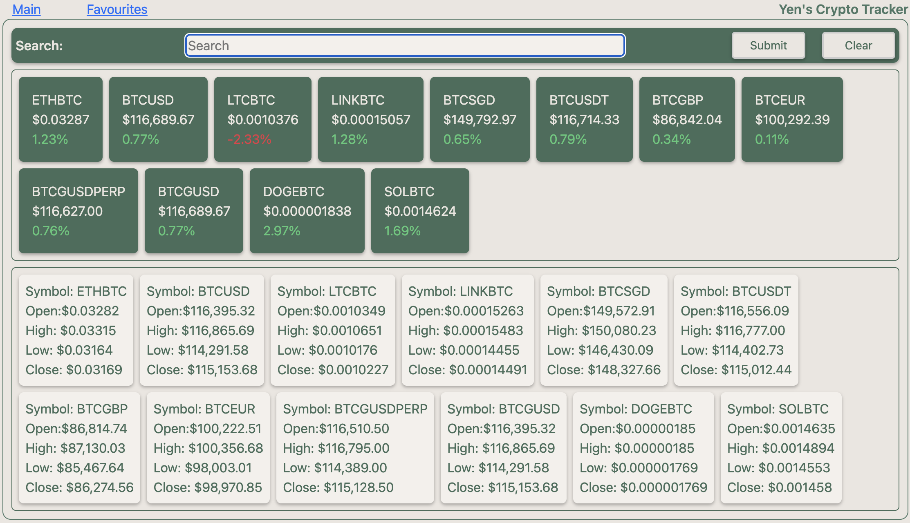
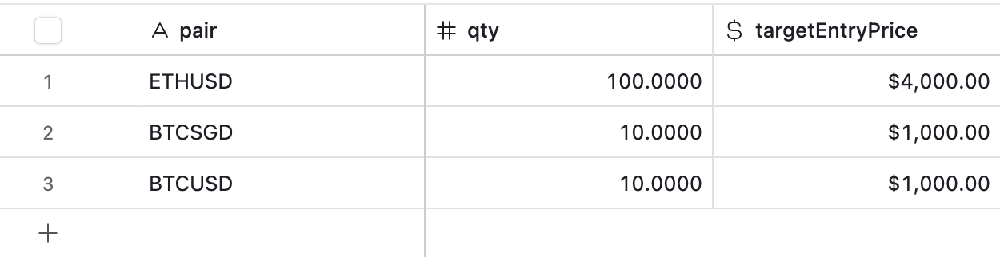

# project_2_Crypto: Yen's Crypto Tracker




---

## Introduction

- I'm yen who created the project_2_crypto App.
- This is to demonstrate the efficient React's componentalised method that allows each feature to be created.
  - This will benefit teamwork to divide and conquer all components and work towards completing the project efficiently.
- I choose to design this cryptocurrency dashboard because:
  - This is highly relevant topic among all financial assets that is well demanded by users.
  - This also able to pull in graphical analysis on the data that is fetched from the server and not just plainly presented by tables.

---

## UserStory

- Users need to see the current price of all the coins
- Users able to search for the coins they want to see and which will push more data of those coins to them
- Users must able to add their fav coins and able to set up their tracker for their own portfolio.
- Users can select the coins they want to see their price trend.

---

## Planning Stage


- Understand the API dictionary nature and data format to see what kind of details to provide
  - Use `Postman` to understand the data format before working on the codes
- Since React is about creating components, i break it down into 2 parts
  - Feature components
    - This is what feature we want to provide and can start working on them concurrently
    - Example will be search feature
  - Functional components
    - These are the reuseable components that supports the feature components such as button and input text etc.
- Can design the outlay of the app to position the components in their efficient and meaningful positions
- To draw out DOM tree diagram to see which data should be stored for easier lifting state and props.
  - Most of the data will be taken via the API directly so this lifting state and props should be minimal.

---

## Important setup

- Package Installation to ensure efficient coding
  - `npm i`
  - `npm i react-router-dom`
  - `npm i @tanstack/react-query
  - `npm i react-chartjs-2 chart.js`
- Files needed to store sensitive API information
  - `.env`
    
- Tools required to review and manipulate data
  - `Postman`
  - `Airtable`
    

---

## Positional coding

- Before starting to code, i need to understand which child components reside in which parent components.
  - This is important to user experience
    - I position the components in a way that follows a logical flow for every user to use without much explanation.
    - The downside might be too structured and user cant customise what they want the App to behave.
    - Hence, i created `main tab` as the structured approach and `favourite tab` as the customised approach.
      - `main tab`: what i want user to see.
      - `favourite tab`: what coins that user want to keep track

---

## App Development


### Initial outlook

- Example of how the positions of each component should reside.
  - I customised `bootstrap` borders using `useContext()` so that can i easily assign border colours to the components as shown above.

### Main.jsx

- `import { BrowserRouter } from "react-router-dom";`
- Setup `<BrowserRouter></BrowserRouter>`
  - To create `Navigation Bar` for various pages

### App.jxs

- Setup `TanStack` via `const queryClient = new QueryClient();`
  - `<QueryClientProvider client={queryClient}>`
- Setup `useContext()`
  - `<BootstrapContext.Provider value={{currencyFormatter, formattedPercentage,}}`
  - I declared my `css boostrap` border colors here so that i can pass them to any child component after App.
- Setup `NavBar`
- Setup `Routes & Route`

### DisplayMain.jsx


- setup `Input.jsx` for search function
  - This is the search logic`item.pair.toLowerCase().includes(search.toLowerCase())`
  - Also to return this to `setDisplayCoin`
  - This is `controlled form`
    
- setup `DisplayCoin.jsx`
  - fetch and manage data via TanStack
  - `setState()`
    - for `coinData` to store as original data
    - and for `displayCoin` to display this data
      
- setup `DisplayCoinSum.jsx`
  - As the API is only able to call one coin at a time
    - we need to iterate the fetch of an array of selected coins from our `displayCoin`
  - To get our array of `displayCoin`
    - `useEffect(() => {displayCoinNames.current = displayCoin.map((item) => item.pair)}, [displayCoin]);`
  - Then run `getCoinSumData()` to fetch via loops and manage it via `TanStack`
  - Finally, link this back to `searchHappened()` so that when i search new coin again it will refetch via `queryCoinSumData.refetch()`

### DisplayFav.jsx


- setup `addData` function to `POST` data to `Airtable` server
  - uses 3 `useRef()`
    - `const symbolRef = useRef();`
    - `const qtyRef = useRef();`
    - `const targetEntryPriceRef = useRef();`
  - Upon clicking `Add` will send these in the `body.field.pair/qty/targetEntryPair` via `useMutation()`
    - And refetch `getData` via `queryClient.invalidateQueries(["airTable"])`
    - And clear the `useRef()` current values.
      
- setup `DisplayFavCoin.jsx` - Run `getData()` to fetch and manipulate data via `TanStack`
  
- setup `<select>` with all the coins stored in the `Airtable` as options to show `DisplayGraph.jsx` via `chart.js`

### DisplayFavCoin.jsx

- Setup `UpdateModal.jsx` and delete function within each coin.
  - Run `deleteData()` with `props.id` to delete the data via `useMutation()`
  - Also use boolean on `updateShowModal()` to pop up `UpdateModal.jsx`
- Also to run `getData()` to fetch coin prices to update here.
- Next is to match the `Airtable`'s `props.field.pair` with `getData`'s `query.pair` to display the coin price
  - The tricky part is if the added coin is not valid, this will create undefined and will crash the App.
    - So we use this control flow to stop the undefined data from flowing through
      - `if (matched !== undefined && Number(matched.price))`

### DisplayGraph.jsx


- Run `getCandles()` to fetch data for the specific coin `props.selectedPairToGraph`
  - Then we run `sortData()` on the data so that it shows the right format before we pass it to `chart.js` via `LineGraph.jsx`

---

## Fetching Data issues

- Needed to fetch data multiple times using different endpoints.
  - We will need to be selective on what to fetch
- Needed to fetch data from endpoints without API dictionary.
  - unable to fetch unless we have more info from the API owner
- How to use fetched Data to pass to other components
  - we can setup `useContext` at `App.jsx` level with useState and pass data around. Like a web.
  - Or we can use `queryClient.getQueryData` to retrieve the stored data in the cache but they only lasted for awhile. Hence best to fetch at the component that requires this data.
  - But safest way is to fetch the Data at the component that required it

---

## Graphing Methods

- I decided to use `chart.js` which is a straightforward library to visualise the data.
- need to use `sort` to flip the data over.

```js
data.sort(function (a, b) {
  return a - b;
});
```

---

## Conclusion

Thanks for reading my explanation on this React project on cryptocurrency.
I hope you like it and feel free to contact me if there's any issue @ yen.compound@gmail.com
